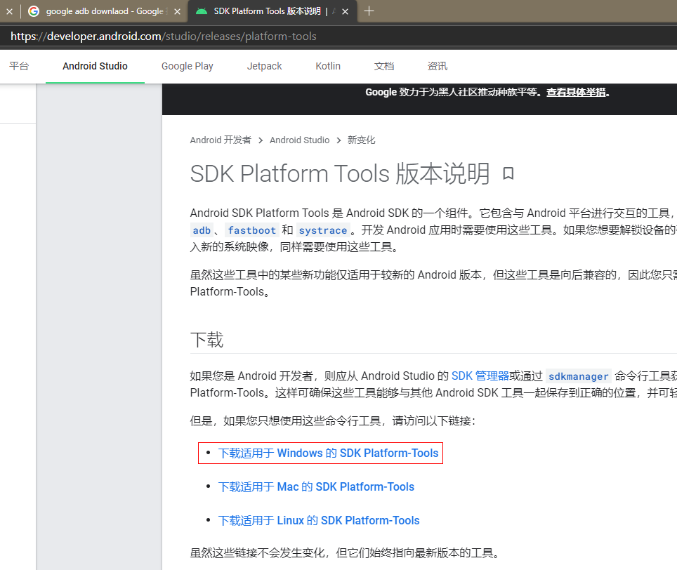
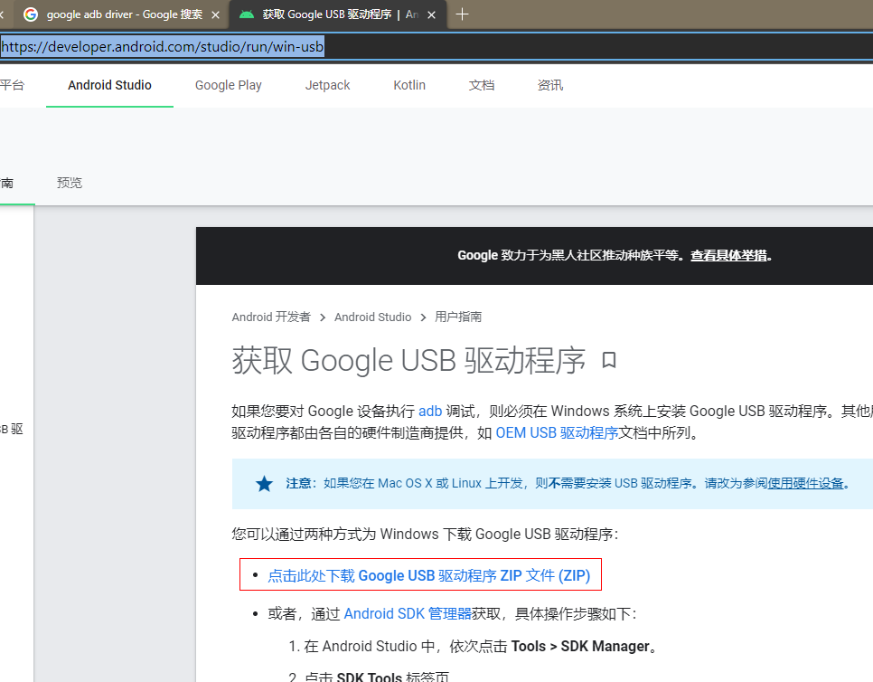
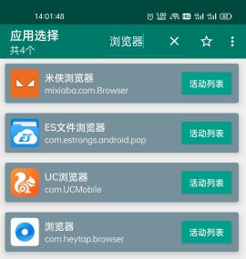
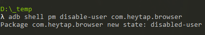
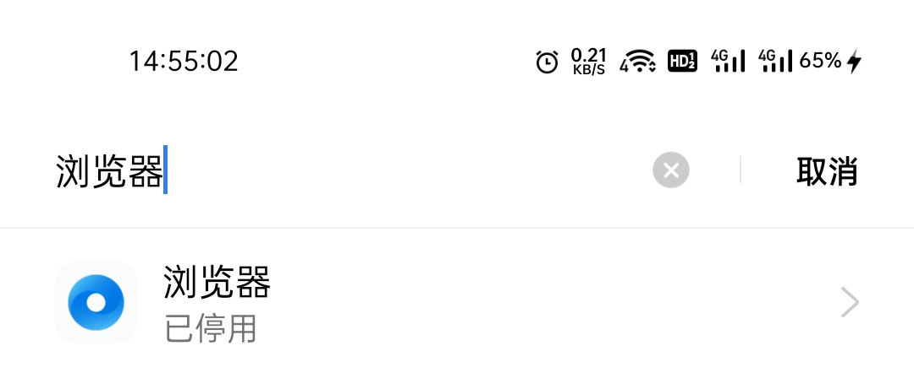

== 前言

新买的 真我GT 自带了一些应用，试过不是很好用，但是手机没有 root，在手机上卸载不了也停用不了，了解到可以用 adb 来停用，于是来试试。

== 准备工作

=== 了解 adb 命令

Google 到相关的命令如下：

查询应用包名：`adb shell pm list packages -s`

启用应用：`adb shell pm enable 包名`

停用应用：`adb shell pm disable-user 包名`

卸载应用：`adb shell pm uninstall -k --user 0  包名`

=== 打开 usb 调试

要执行 adb 命令，手机需要使用 usb 连接电脑，现在的手机开发者选项都是隐藏了的，可以看到设置-其他设置，SIM 应用下面是最近任务。

进入设置-关于手机-版本信息-版本号点7下-输入密码打开开发者模式。

现在设置-其他设置，SIM 应用下面是开发者选项了，点进去，打开 usb 调试。

image::usb调试.gif[]

=== 安装 adb

Google 搜到 adb 下载地址，下载 windows 版本 adb

link:https://developer.android.com/studio/releases/platform-tools[]

解压，配置环境变量，执行 `adb version`，可以看到安装成功了。

image::adb-version.png[]

插上 usb 线，执行 `adb devices` 可以看到设备已经识别了。

image::adb-devices.png[]

如果无法发现设备，可能需要安装 adb 驱动，可以试下这个：

link:https://developer.android.com/studio/run/win-usb[]

== 获取所有应用包名

在命令行中执行 `adb shell pm list packages -s > packages.txt`，就把所有应用包名写入到了 `packages.txt`。

image::packages-txt.png[]

== 找出应用对应的包名

下载创建快捷方式应用：

link:https://www.coolapk.com/apk/com.x7890.shortcutcreator[]

打开 `创建快捷方式` 应用，右上角勾上显示系统应用

image::创建快捷方式-系统app.jpg[]

搜索 `浏览器`，可以找到系统自带的浏览器，包名为：`com.heytap.browser`

== 测试命令

执行下命令测试下：`adb shell pm disable-user com.heytap.browser`

可以看到浏览器已经被停用

== 停用脚本

将以下内容保存到文本文档，重命名文档为 `disable.bat` 执行：

[source,shell script]
----
@echo off

title 停用真我GT应用 by c332030

:: 启用
:: set command=adb shell pm enable
:: 停用
set command=adb shell pm disable-user

:: 乐划锁屏
%command% com.heytap.pictorial

:: 音乐
%command% com.heytap.music

:: 小布
%command% com.heytap.speechassist

:: 浏览器
%command% com.heytap.browser

:: 快应用
%command% com.nearme.instant.platform

:: 视频
%command% com.heytap.yoli

:: 图库
%command% com.coloros.gallery3d

pause >nul

----

输入如下：

image::disable-script-output.png[]

在 `bat` 中，双冒号是注释，启用应用时注释/取消注释对应的命令。

== 后记

玩机过的老哥就会注意到，这里只是停用了，没有清除应用数据，我有找到清除应用的命令：`adb shell pm clear 包名`，但是执行时却报错了，大意是真我禁用了这个命令，其他品牌可以试试，我这是手动清的数据。

+++ 

 +++
错误日志:
+++ 

 +++
----
Exception occurred while executing 'clear':
java.lang.SecurityException: adb clearing user data is forbidden.
        at com.android.server.pm.OplusClearDataProtectManager.interceptClearUserDataIfNeeded(OplusClearDataProtectManager.java:87)
        at com.android.server.pm.OplusBasePackageManagerService$OplusPackageManagerInternalImpl.interceptClearUserDataIfNeeded(OplusBasePackageManagerService.java:490)
        at com.android.server.am.ActivityManagerService.clearApplicationUserData(ActivityManagerService.java:4692)
        at com.android.server.pm.PackageManagerShellCommand.runClear(PackageManagerShellCommand.java:2148)
        at com.android.server.pm.PackageManagerShellCommand.onCommand(PackageManagerShellCommand.java:237)
        at android.os.BasicShellCommandHandler.exec(BasicShellCommandHandler.java:98)
        at android.os.ShellCommand.exec(ShellCommand.java:44)
        at com.android.server.pm.PackageManagerService.onShellCommand(PackageManagerService.java:23342)
        at android.os.Binder.shellCommand(Binder.java:936)
        at android.os.Binder.onTransact(Binder.java:820)
        at android.content.pm.IPackageManager$Stub.onTransact(IPackageManager.java:4603)
        at com.android.server.pm.PackageManagerService.onTransact(PackageManagerService.java:4844)
        at com.android.server.pm.OplusPackageManagerService.onTransact(OplusPackageManagerService.java:150)
        at android.os.Binder.execTransactInternal(Binder.java:1166)
        at android.os.Binder.execTransact(Binder.java:1130)
----
+++ 

 +++
