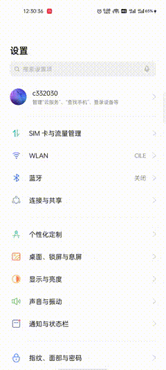
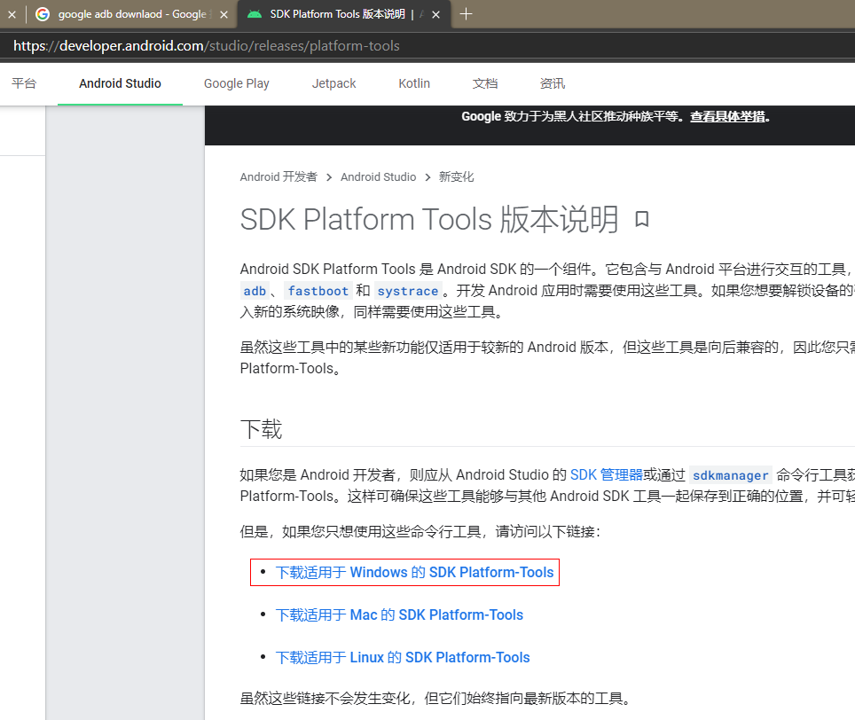
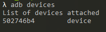
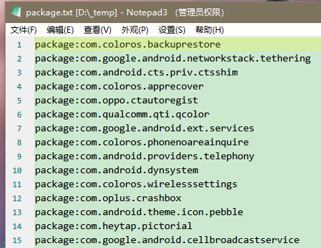
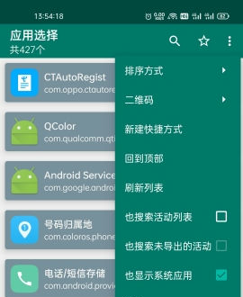
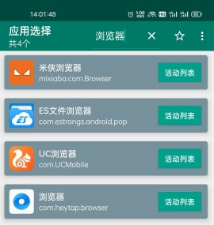
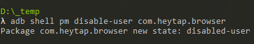
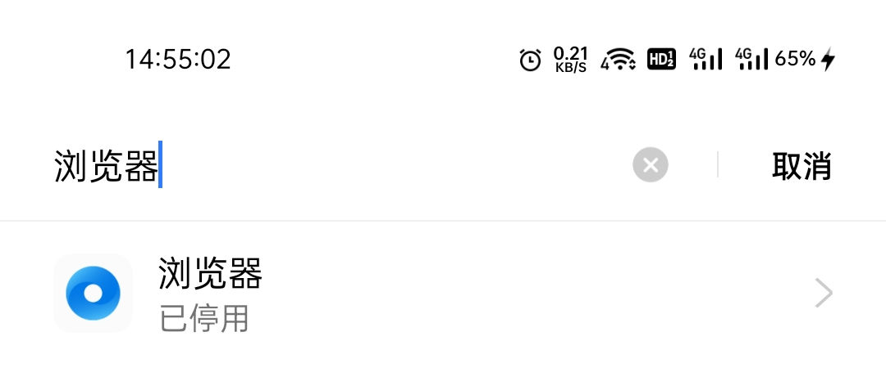
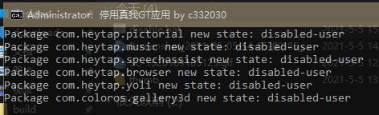

== 前言

新买的 真我GT 自带了一些应用，试过不是很好用，但是手机没有 root，在手机上卸载不了也禁用不了，了解到可以用 adb 来禁用，于是来试试。

== 准备工作

=== 了解 adb 命令

Google 到相关的命令如下：

查询应用包名：`adb shell pm list packages -s`

启用应用：`adb shell pm enable 包名`

禁用应用：`adb shell pm disable-user 包名`

=== 打开 usb 调试

要执行 adb 命令，手机需要使用 usb 连接电脑，步骤如下：

. 打开开发者选项

现在的手机开发者选项都是隐藏了的，可以看到设置-其他设置，SIM 应用下面是最近任务。

进入设置-关于手机-版本信息-版本号点7下-输入密码打开开发者模式。

现在设置-其他设置，SIM 应用下面是开发者选项了，点进去，打开usb调试。

=== 安装 adb

Google 搜到 adb 下载地址，下载 windows 版本 adb

link:https://developer.android.com/studio/releases/platform-tools[]

解压，配置环境变量，执行 `adb version`，可以看到安装成功了。

image::adb-version.png[]

插上 usb 线，执行 `adb devices` 可以看到设备已经失败了。

如果无法发现设备，可能需要安装 adb 驱动，可以试下这个：

link:https://developer.android.com/studio/run/win-usb[]

image::adb-driver.png[]

== 获取所有应用包名

在命令行中执行 `adb shell pm list packages -s > packages.txt`，就把所有应用包名写入到了 `packages.txt`。

== 找出应用对应的包名

下载创建快捷方式应用，去酷安下载最新版或者下载我这分享的版本：

link:https://www.coolapk.com/apk/com.x7890.shortcutcreator[]

link:创建快捷方式.apk[]

打开 `创建快捷方式` 应用，右上角勾上显示系统应用

搜索 `浏览器`，可以找到系统自带的浏览器，包名为：`com.heytap.browser`

== 测试命令

执行下命令测试下：`adb shell pm disable-user com.heytap.browser`

可以看到浏览器已经被停用

== 禁用脚本

将以下内容保存到文本文档，重命名文档为 `disable.bat` 执行：

[source,shell script]
----
@echo off

title 停用真我GT应用 by c332030

:: 启用
:: set command=adb shell pm enable
:: 停用
set command=adb shell pm disable-user

:: 乐划锁屏
%command% com.heytap.pictorial

:: 音乐
%command% com.heytap.music

:: 小布
%command% com.heytap.speechassist

:: 浏览器
%command% com.heytap.browser

:: 视频
%command% com.heytap.yoli

:: 图库
%command% com.coloros.gallery3d

pause >nul

----

输入如下：

在 `bat` 中，双冒号是注释，启用应用时注释/取消注释对应的命令。
