== 前言

公司项目的版本号要么是快照版本（以-SNAPSHOT），要么是发行版本却一直在一个分支上开发，这就会有几个问题：

. maven 默认不下载快照版本的依赖，导致私服上有依赖也下载不下来；
. 使用发行版本时，却从来不变更版本号，导致依赖有更新却不会去私服上下载；
. 一直在单个分支上开发就会导致代码有变更时，旧项目无法再取到未变更的依赖，
我们也没法保留之前上线过的版本的源代码，导致旧版本有需求时，不得不加在在最新的代码上，
部署也是部署最新的代码，很多不是此次上线的功能也部署上去了。

除却版本定义和单分值的问题外，还有以下问题：

. 项目中的版本号都是手动管理，在 dependencies 中添加模块依赖时，要么采用占位符 ${} 的方式，
要么直接把版本号写在这里，这就导致后面版本号的更新操作变得困难或无法自动化处理。

== 方案

针对公司项目管理的这些问题，在征得领导的同意后，采取以下措施进行解决：

. 对项目的分支进行标准化管理，重点是功能变更测试完成后需要打 tag（具体见后文）；
. 对开发分支使用快照版本，为其他开发成员开启下载快照版本的功能；
. 对项目中所有当前项目的模块依赖直接指定版本号（便于使用自动化工具），并且对其他项目会用到的模块在根目录的 pom.xml 中使用 dependencyManagement 管理，这样子模块中的模块依赖就不需要指定版本号；
. 打 tag 之前，保证项目中依赖的其他项目的模块版本号都是发行类型（不以 -SNAPSHOT 结尾），保证依赖的代码不会变更；
. 打完 tag 的项目是发行版本，不再接受代码变更，并且上传依赖到私服；
. 新建一个 pom 类型的项目，名称以 -bom 结尾（参考 spring，不使用 dependencies 的原因是 bom 更方便输入）；
. 把 dependencyManagement 中的模块依赖复制过来。

== 具体操作

=== 示例项目介绍

首先介绍下为了写这个建的两个示例项目

==== c-commons

这个项目取名：c-commons，名字参考了 apache 的 commons 项目，顾名思义，存放公共代码的地方

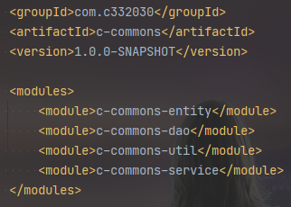

==== c-mall

这个是一个商城的项目，这个项目要依赖 c-commons 中的模块：

image::.images/mall-modules.png[]

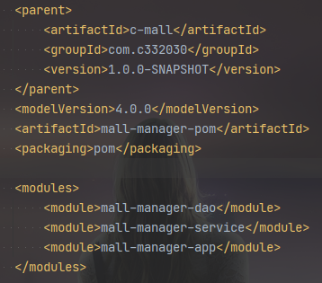

=== 1. 调整依赖

首先，所有引用到了模块中子模块的地方都直接指明版本号，这里还分两种情况

. 会被多个模块或者其他项目引用的模块；
. 只会被某一个模块引用的模块。

先说第二种情况，这种情况下，直接在引用的地方加上版本号。

如果是第一种情况，我们在根目录的 pom.xml 中添加 dependencyManagement 标签，把这些会被多次引用的模块添加到其中，如图：

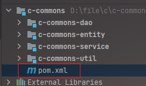

image::.images/c-commons-dependencyManagement.png[]

而在当前项目其他模块中使用时，可以不指定版本号，此时 idea 左侧出现蓝色跳转符号：

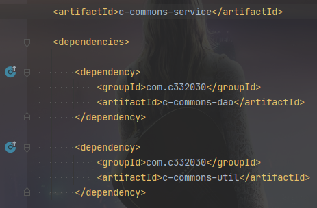

当鼠标悬浮在符号上时，可以看到此处虽然没有指定版本号，但是却能够找到确切的版本，这个版本号是在 dependencyManagement 中定义的、

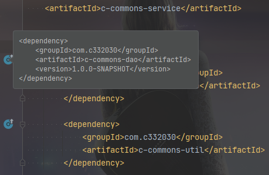

我这里还建了一个名为 c-commons-bom 的项目，目的是方便其他项目依赖 c-commons 和统一依赖版本。

可以看到这个项目只有一个 pom.xml 文件：

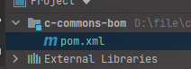

细心的人会发现，我在 c-commons 的 pom.xml 文件中加了星号的注释，这样的注释是成对的，包裹着其他项目会依赖的模块。我把这些模块复制到 c-commons-bom 中。

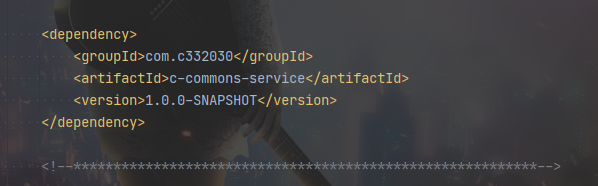

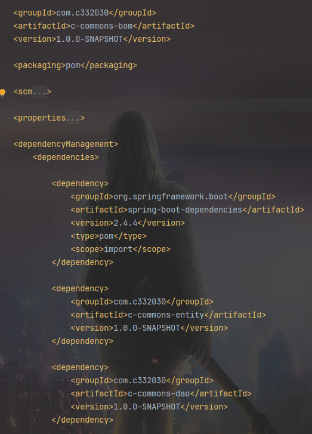

对 c-commons 和 c-commons-bom 项目分别执行 mvn clean install 命令，把项目存到本地仓库中。

在 c-mall 中以 type=pom 和 scope=import 的方式引用：

image::.images/mall-pom.png[]

在 c-mall 中引用 c-commons 中的模块时，可以发现，也不需指定版本号了。

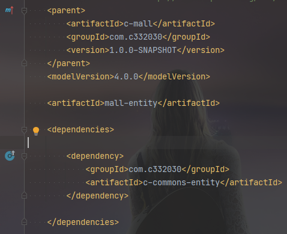

点进去，版本号是在本地仓库 c-commons-bom 项目中指定的：

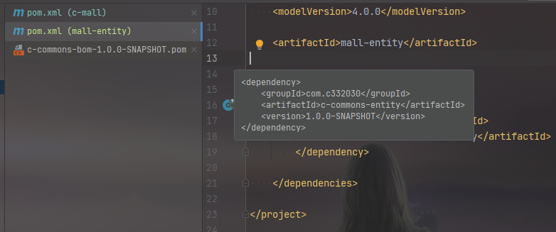

dependencyManagement 中还可以加入其他依赖并添加到 c-commons-bom 中，比如 fastjson，这样引入 c-commons 项目模块时，可以统一所有项目的 fastjson 版本。

=== 2. 更新版本号

这里用到 maven 插件 `Versions Maven Plugin`，可以管理项目的版本号

https://www.mojohaus.org/versions-maven-plugin/

用到的命令如下：

更新版本号：`mvn versions:set`

回滚版本号：`mvn versions:revert`

执行命令时，会提示输入新的版本号：

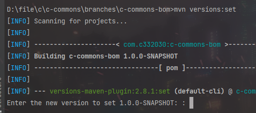

执行完会生成 `.versionsBackup` 的备份文件，用于回滚版本号

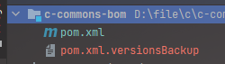

回滚：

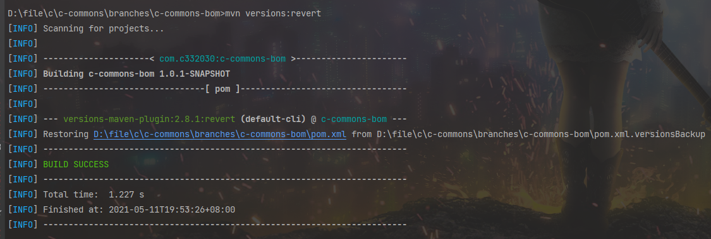

因为其他同事之前手动上传过 jar 到私服，指定了版本号，为了不冲突，需要指定一个新的版本号，命令如下：

[source,shell script]
----
mvn versions:set ^
    -DnewVersion=1.0.1-SNAPSHOT
----

=== 3. 生成 tags

这里用到 `Maven Release Plugin` 插件

https://maven.apache.org/maven-release/maven-release-plugin/

用到的命令如下：

版本号更新：`mvn release:prepare`

版本号回滚：`mvn release:rollback`

需要注意的是，这里需要在项目根 `pom.xml` 中添加 `scm` 标签，其中 `developerConnection` 是当前分支路径，`connection` 是项目的 svn 根路径。

[source,xml]
----
<?xml version="1.0" encoding="UTF-8"?>
<project xmlns="http://maven.apache.org/POM/4.0.0" xmlns:xsi="http://www.w3.org/2001/XMLSchema-instance"
    xsi:schemaLocation="http://maven.apache.org/POM/4.0.0 http://maven.apache.org/xsd/maven-4.0.0.xsd">

    <!-- 忽略其他 -->

    <scm>
        <developerConnection>scm:svn:https://localhost:8443/svn/c/project/c-commons/branches/c-commons</developerConnection>
        <connection>scm:svn:https://localhost:8443/svn/c/project/c-commons</connection>
    </scm>

    <!-- 忽略其他 -->

</project>

----

同时，项目的 svn 结构如下：
[source,text]
----
c-commons
  branches
    c-commons
    c-commons-2.0.0-SNAPSHOT-jdk8
  tags
    c-commons-1.0.0
----

`branches` 文件夹下存放分支，项目同名目录 `c-commons` 存放主干，其他的是并行开发的分支。这里主干不放到 `trunk` 的原因是：`trunk` 目录 `checkout` 下来的文件夹和项目名称不一致，为了 `checkout` 后不需要修改文件夹名称，主干我放到 `branches` 下面。

目前 branches 下只有 c-commons 目录，tags 目录是空的，因为我还没执行命令。

这里需要 checkout 项目到新路径，因为使用 release 插件时，项目中不能存在有变更或者未受版本管理的文件，我这里执行：

[source,shell script]
----
mvn release:prepare ^
    -DautoVersionSubmodules=true
----

执行后，会提示输入三次：

. 第一次提示输入当前开发版本的发布版本，默认就是删除 `-SNAPSHOT` 的版本号；
. 第二次提示输入 tags 目录下新分支名称，默认是 '项目名称-发布版本号'；
. 第三次提示输入新的开发版本号，默认当前版本号 x.y.z 中的 z 加一。

没有特殊要求，按三次回车就好了。

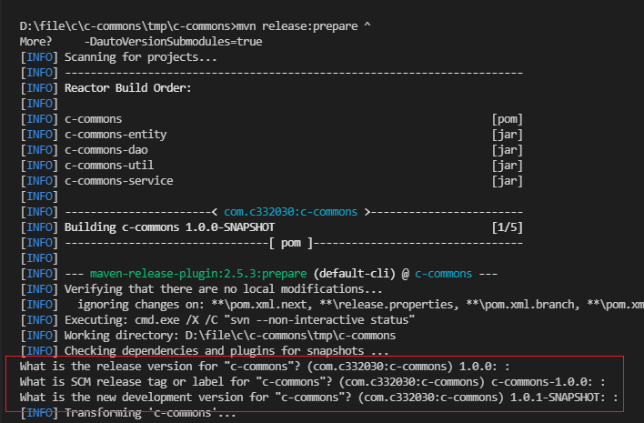

执行完可以看到 tags 下多出新分支：

image::.images/svn-tags.png[]

tags 下的分支版本号是发行类型的（没有后缀 -SNAPSHOT），scm 标签下的链接也更新了。

image::.images/svn-tags-1.0.0.png[]

branches 下主分支版本号已更新：

image::.images/svn-branches-trunk-root-pom.png[]

image::.images/svn-branches-trunk-root-pom-modules.png[]

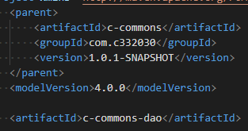

需要注意的是，如果执行过程中发送错误，同时有部分代码已经提交了 svn，可以执行 `mvn release:rollback` 进行回滚，我这里就出错了。可以看到，编号为 11 的提交是执行 `prepare` 命令，编号为 12 的提交是 `rollback` 命令：

image::.images/svn-history.png[]

== 发布

这里把 tags 下的分支 checkout 下来，执行 `mvn clean deploy` 就可以发布私服了，具体配置这里不作阐述，因为配置不复杂，而 nexus 私服的搭建又需要讲很多内容。

== 后记

完成整个流程还是花了我不少时间，踩了不少坑，网友如果有疑问，欢迎交流。
