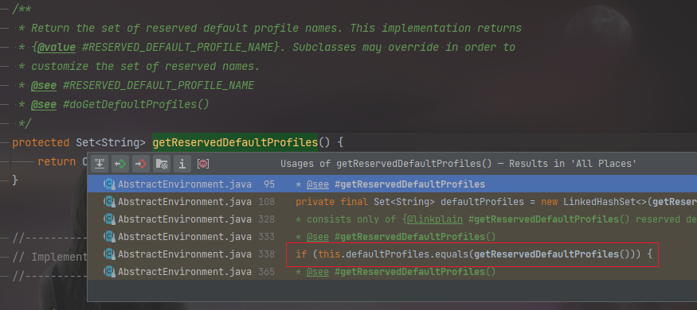

== 问题发现

springboot 2.4.4
logback-classic-1.2.3.jar

完全没有日志

== 问题跟踪

ch.qos.logback.classic.Logger#callAppenders

ch.qos.logback.classic.Logger#appendLoopOnAppenders

ch.qos.logback.classic.Logger#aai

image::images/aai.png[aai变量]

ch.qos.logback.classic.Logger#addAppender

打断点发现未调用

修改成一个不存在的文件，结果报错，说明原来的配置文件可以读到的

然后我去看 logback-console.xml，因为这个文件是管理控制台输出的

ch.qos.logback.core.ConsoleAppender

找到控制台输出的这个类，点进去，每个方法第一行代码都打个断点，重启 springboot，发现并没有进入断点

然后我注意到并没有生成日志日志文件，回到上级 logback-spring.xml 可以看到，每个 spring 配置都
配置了日志输出到文件

我看下 spring.profiles.active 的值，这里是没有配置的，没有配置的情况下，spring.profiles.active 的值是 default，
我在 logback-spring.xml 中把 default 和 dev 配置在一起

我新建一个 springboot 项目，看到这句话，确定了我的想法

[source,text]
----
No active profile set, falling back to default profiles: default
----

image::images/springboot-peofiles-default.png[]

我指定指定 spring.profiles.active=dev 后，日志出来了

== 问题排查

然后我准备去看这个配置的加载流程，却发现这句话是启动类打印的，idea 全局搜没有搜到。

打开 github.com，找到 spring 的源码，全局搜素：No active profile set，在这个类中找到关键字

link:https://github.com/spring-projects/spring-framework/blob/9417975f66f28de514f4909bc25f037934ac23e6/spring-core/src/main/java/org/springframework/core/env/AbstractEnvironment.java[AbstractEnvironment.java]

在 idea 中找到这个类，发现只有两个地方引用到了

跟踪：org.springframework.core.env.AbstractEnvironment#getReservedDefaultProfiles

一个地方引用，继续跟踪

找到 doGetDefaultProfiles 方法，发现默认情况下这个 if 的结果是 true，
这里再判断说明有代码会修改 defaultProfiles

org.springframework.core.env.AbstractEnvironment#doGetDefaultProfiles

搜索这个文件，发现只有两个地方修改，在 设置 active=dev 的情况下，打断点启动只调用了 setDefaultProfiles，
而且参数是 ["default"]

[source,shell script]
----
org.springframework.core.env.AbstractEnvironment#setDefaultProfiles
org.springframework.core.env.AbstractEnvironment#merge
----

启动时发现也调用了 doGetDefaultProfiles，根据上去，发现了熟悉的内容，调用的类是 springboot 中的

[source,text]
----
org.springframework.boot.SpringApplication#logStartupProfileInfo
----

有人就要问了，为什么不直接去 springboot 的源码中搜索这句话，你以为我没搜吗？但是发现结果是这样的，
本着最优匹配结果排序的原则，看到这里，我直接去跟代码了。

link:https://github.com/spring-projects/spring-boot/blob/f45202e86fde957a4bcce307f2a65a0fc409d5ac/spring-boot-project/spring-boot/src/main/java/org/springframework/boot/SpringApplication.java[SpringApplication]

我跟到这里的时候，又去搜了一遍，这次在第三页（总共三页）的最后一条结果找到了，我也不知道该说啥了

link:https://github.com/spring-projects/spring-boot/search?p=1&q=No+active+profile+set[https://github.com/spring-projects/spring-boot/search?p=1&q=No+active+profile+set]

打断点调试，发现我指定的配置了

这次删掉 active，再次调试，发现确实有打印日志，但是控制台却没有日志，唉，[手动捂脸]

== 继续跟踪

我只能继续往上面跟了，打开之前新建的 springboot 项目，同样在这里打断点，发现走到这里的时候，控制台已经打印了一行日志，
这说明日志配置的读取比这里要前

activeProfiles 取到的配置是空的

这次我使了个坏，指定了一个不存在的文件，但是却没有保存

然后我去跟踪 AbstractEnvironment#doGetDefaultProfiles

打断点跟踪：

org.springframework.boot.context.config.Profiles#getActivatedProfiles
org.springframework.boot.context.config.ConfigDataEnvironment#processAndApply
