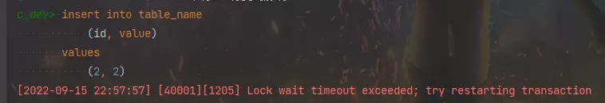

== 发现问题

最近写的一个定时任务出现了主键冲突，数据插入失败了。我记得我有在插入前查询是否存在，但是仍然出现了这种情况。

翻阅日志发现，查询回来的记录数量为 0，插入又失败了。

我想到了几种情况：

. 数据在其他事务里插入了，但还没提交，导致这个事务里查询不存在但插入失败，因为我们的事务级别是可重复读；
. 主从架构，查询的从库，数据不是最新。

思索过后，发现第二张情况不满足，因为我们的测试环境只有一个数据库，那就只有第一种情况了。

== 使用行锁

所以，我把业务代码调整了下：

之前

. 查询记录
. 不存在则插入记录
. 使用查回来或者新建的对象

现在

. 使用 `insert on duplicate key update` 插入或者更新数据（当前事务锁定记录）
. 查询记录
. 使用查回来的对象

成功解决问题。

我知道会存在这种情况，但是之前这样写都没有发生过这种情况，也就放松了警惕。

== 使用间隙锁

如果说，要求一定要先查询，判断不存在在插入，而且不能发生主键冲突，那又该如果处理呢？

那只能在查询时加上锁了，可是记录不存在，那锁的是表吗？我猜可能是间隙锁，刚好趁这个机会，测试一下间隙锁。

首先，我先建立这样一张表

[source, sql]
----
create table table_name
(
    id    int auto_increment primary key,
    value int null
);
----

插入测试数据

[source,sql]
----
insert into table_name
    (id, value)
values
    (1, 1),
    (2, 3)
----

然后将 idea 改成 `手动事务` 模式

查询并锁定不存在的记录，`for update` 用于查询时锁定记录

[source,sql]
----
select *
from table_name
where id = 2
for update
----

在另一个连接（也就是另一个事务）里插入 id = 2 的记录，结果报获取锁超时，证实了锁的存在，那是表锁还是间隙锁呢？

[source,sql]
----
insert into table_name
    (id, value)
values
    (2, 2)
----

试下插入 id = 4 的记录，插入成功

[source,sql]
----
insert into table_name
    (id, value)
values
    (4, 4)
----

试下删除 id = 1 和 3 的记录，删除成功，证明了不是表锁。

[source,sql]
----
delete from table_name
where id (1, 3)
----

然后我们再提交查询锁定 id = 2 记录的事务，再次执行插入 id = 2 的记录，成功插入。

证实 `select ... for update` 可以在不存在记录的情况下，可以使用间隙锁，避免在事务未提交的情况下，其他事务插入了查询锁住的 id 值记录。

其实吧，这个就是 `幻读`，我也是写完这篇文章后，才发现的，所以 MySQL 可重复读不能解决幻读，但是可以通过一些手段保障避免幻读产生。
