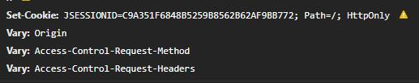

== 发现问题

在开发公司一个 H5 后台接口的时候，前端突然和我说接口抛了异常，但当我知道是哪个接口后，却陷入的疑惑，因为报错的是历史接口，都没动过。

通过看日志才发现是 token 没有传，请求头里没有，浏览器 application Cookie 里也看不到，找到设置 Cookie 的地方，发现 Set-Cookie 响应头后面有个感叹号，不管是控制台还是点击感叹号、鼠标悬浮感叹号上，都没有任何提示信息。

所有 Set-Cookie 后面都有感叹号，所以图片截的是 jsessionid 的

经过查找资料发现，Chrome 有个 SameSite 的属性，这个值默认是 None，也就是允许所有第三方 Cookie
