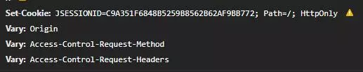
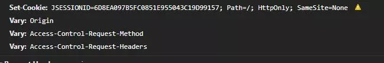
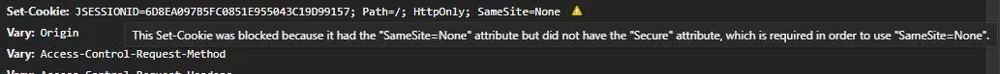
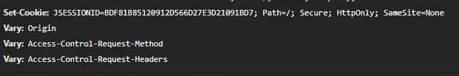

== 发现问题

在开发公司一个 H5 后台接口的时候，前端突然和我说接口抛了异常，但当我知道是哪个接口后，却陷入了疑惑，因为报错的是历史接口，都没动过。

通过看日志才发现是 token 没有传，请求头里没有，浏览器 application Cookie 里也看不到，找到设置 Cookie 的地方，发现 Set-Cookie 响应头后面有个感叹号，不管是控制台还是点击感叹号、鼠标悬浮感叹号上，都没有任何提示信息。

所有 Set-Cookie 后面都有感叹号，所以图片截的是 jsessionid 的

经过查找资料发现，从 Chrome 51 起加个 SameSite 的属性，用于防御 跨站请求伪造（CSRF），这个值默认是 None，也就是允许所有第三方 Cookie，然而从 Chrome 80 开始，SameSite 的默认值变成了 Lax。

微信授权需要 https，而本地没有 https 的条件（域名证书公司领导管理），虽然一级域名一样，但是还是无法保存 Cookie。

== 解决问题

我们的页面是嵌入微信小程序的，不存在开放 H5 直接访问的可能，所以这里我可以将 SameSite 的值手动设置为 None。

=== 方案1 不使用 HttpServletResponse.addCookie

但当我动手时，又发现 Servlet API 4.0.1 中 Cookie 对象并不支持 SameSite 属性，于是我决定不使用 HttpServletResponse.addCookie，手动拼接响应报文头。

[source,java]
----
/**
 * Web 工具类，判断是不是 https
 * @author c332030
 */
public class WebUtils {

    public static final String HTTPS = "https";

    private WebUtils() {}

    public static boolean isHttps(HttpServletRequest request) {

        // 考虑到 nginx 代理的情况，读取：X-Forwarded-Proto
        String scheme = request.getHeader(HttpHeaders.X_FORWARDED_PROTO);
        if(StringUtils.isEmpty(scheme)) {
            scheme = request.getScheme();
        }

        return HTTPS.equalsIgnoreCase(scheme);
    }

}
----

[source,java]
----

/**
 * Cookie 工具类
 * @author c332030
 */
public class CookieUtils {

    private CookieUtils() {}

    public static final String HTTPS = "https";

    public static final String Cookie_Domain = "; Domain=";

    public static final String Cookie_Path = "; Path=";

    public static final String Cookie_MaxAge = "; Max-Age=";

    public static final String Cookie_Secure = "; Secure";

    public static final String Cookie_HttpOnly = "; HttpOnly";

    public static final String Cookie_SameSite = "; SameSite=";

    public static final String Cookie_SameSite_None = "None";
    public static final String Cookie_SameSite_Lax = "Lax";
    public static final String Cookie_SameSite_Strict = "Strict";

    /**
     * 添加 Cookie，替代 HttpServletResponse.addCookie()
     */
    public static void addCookie(HttpServletRequest request, HttpServletResponse response, Cookie cookie) {

        StringBuilder cookHeaderStr = new StringBuilder();
        cookHeaderStr.append(cookie.getName());
        cookHeaderStr.append("=");
        cookHeaderStr.append(cookie.getValue());

        StringOptional.ofEmptyAble(cookie.getDomain()).ifNotEmpty(e -> {
            cookHeaderStr.append(Cookie_Domain);
            cookHeaderStr.append(e);
        });

        cookHeaderStr.append(Cookie_Path);
        String path = StringUtils.isNotEmpty(cookie.getPath()) ? cookie.getPath() : "/";
        cookHeaderStr.append(path);

        if(cookie.getMaxAge() >= 0) {
            cookHeaderStr.append(Cookie_MaxAge);
            cookHeaderStr.append(cookie.getMaxAge());
        }

        // SameSite=None 且 https 时，需要设置 Secure 属性
        if(WebUtils.isHttps(request) || cookie.getSecure()) {
            cookHeaderStr.append(Cookie_Secure);
        }

        if(cookie.isHttpOnly()) {
            cookHeaderStr.append(Cookie_HttpOnly);
        }

        cookHeaderStr.append(Cookie_SameSite);
        cookHeaderStr.append(Cookie_SameSite_None);

        response.addHeader(HttpHeaders.SET_COOKIE, cookHeaderStr.toString());

    }

}
----

如果在 https 的网络下设置 SameSite=None 但没有设置 Secure 属性时，也会出现感叹号，不过这个时候是有提示的。

这个时候 token 的 Cookie 是管用了，可是 jsessionid 的 Cookie 没有加上 SameSite 属性，我只能换一种方案。

=== 方案2 使用过滤器

于是我想到了过滤器，直接上代码。

[source,java]
----
/**
 * 常量类不解释
 * @author c332030
 */
public class HttpHeaderConstants {

    private HttpHeaderConstants() {}

    public static final String HTTPS = "https";

    public static final String Cookie_SameSite = "SameSite";

    public static final String Cookie_SameSite_Strict = "Strict";

    public static final String Cookie_SameSite_Lax = "Lax";

    public static final String Cookie_SameSite_None = "None";

    public static final String Cookie_Secure = "Secure";

}
----

[source,java]
----
/**
 * Cookie 工具类
 * @author c332030
 */
public class CookieUtils {

    private CookieUtils() {}

    public static String getAppendedHeader(String header, String key) {
        return getAppendedHeader(header, key, null);
    }

    public static String getAppendedHeader(String header, String key, String value) {
        StringBuilder stringBuilder = new StringBuilder(header);
        append(stringBuilder, key, value);
        return stringBuilder.toString();
    }

    public static void append(StringBuilder headerBuilder, String key) {
        append(headerBuilder, key, null);
    }

    public static void append(StringBuilder headerBuilder, String key, String value) {

        headerBuilder.append("; ");
        headerBuilder.append(key);

        if (StringUtils.isNotEmpty(value)) {
            headerBuilder.append("=");
            headerBuilder.append(value);
        }
    }

    /**
     * 获取 HttpServletResponse 中已有的 Cookie，然后拼接上 SameSite 属性
     * @author c332030
     */
    public static void appendSameSite(HttpServletRequest request, HttpServletResponse response, String defaultSameSiteValue) {

        Collection<String> cookieHeaders = response.getHeaders(HttpHeaders.SET_COOKIE);
        if(CollectionUtils.isEmpty(cookieHeaders)) {
            return;
        }

        List<String> cookieHeadersNew = new ArrayList<>(cookieHeaders.size());
        cookieHeaders.forEach(cookieHeader -> {

            if (cookieHeader.contains(HttpHeaderConstants.Cookie_SameSite)) {
                cookieHeadersNew.add(cookieHeader);
                return;
            }

            StringBuilder stringBuilder = new StringBuilder(cookieHeader);

            // SameSite=None
            CookieUtils.append(stringBuilder, HttpHeaderConstants.Cookie_SameSite, defaultSameSiteValue);

            // Secure
            if (WebUtils.isHttps(request) && !cookieHeader.contains(HttpHeaderConstants.Cookie_Secure)) {
                CookieUtils.append(stringBuilder, HttpHeaderConstants.Cookie_Secure);
            }

            cookieHeadersNew.add(stringBuilder.toString());
        });

        Iterator<String> cookieHeadersIterator = cookieHeadersNew.iterator();

        // clear old cookies
        response.setHeader(HttpHeaders.SET_COOKIE, cookieHeadersIterator.next());
        while (cookieHeadersIterator.hasNext()) {
            response.addHeader(HttpHeaders.SET_COOKIE, cookieHeadersIterator.next());
        }
    }

}
----

[source,java]
----
/**
 * SameSite 过滤器
 * @author c332030
 */
public class SameSiteFilter implements Filter {

    @Override
    public void doFilter(HttpServletRequest request, HttpServletResponse response, FilterChain chain) throws IOException, ServletException {

        chain.doFilter(request, response);

        // 执行完业务流程再修改 Cookie
        CookieUtils.appendSameSite(request, response, HttpHeaderConstants.Cookie_SameSite_None);

    }

}

----

在单元测试中，CookieUtils.appendSameSite 方法正常运行，字符串拼接的值也是对的，可是返回的报文中却没有 SameSite 和 Secure 属性。

查找 Stackoverflow 资料得知，response.setHeader 需要修改响应，但响应请求已经提交时，服务器就会忽略对 response 做出的修改。

过滤器中出现这种情况只发生在添加了 @ResponseBody 注解的接口上。

这个问题刚发现的时候，着实让我无法理解，后来我想到 response.getWriter 关闭后再写入数据时会报错，我也就理解了。

这个时候就只能在提交前做修改了。

=== 方案3 实现 ResponseBodyAdvice 在提交前做修改

还好有先见之明，考虑到拼接 SameSite 的需求可能会在其他地方用到，所以抽离出了 CookieUtils.appendSameSite 方法。

[source,java]
----
/**
 * 实现 ResponseBodyAdvice，在提交前修改 Cookie
 * @author c332030
 */
@ControllerAdvice
public class SameSiteControllerAdvice implements ResponseBodyAdvice<Object> {

    @Override
    public boolean supports(MethodParameter returnType, Class<? extends HttpMessageConverter<?>> converterType) {
        return true;
    }

    @Override
    public Object beforeBodyWrite(Object body, MethodParameter returnType, MediaType selectedContentType,
                                  Class<? extends HttpMessageConverter<?>> selectedConverterType,
                                  ServerHttpRequest serverHttpRequest,
                                  ServerHttpResponse serverHttpResponse) {

        HttpServletRequest request = ((ServletServerHttpRequest) serverHttpRequest).getServletRequest();
        HttpServletResponse response = ((ServletServerHttpResponse) serverHttpResponse).getServletResponse();

        CookieUtils.appendSameSite(request, response, HttpHeaderConstants.Cookie_SameSite_None);

        return body;
    }
}

----

以前只知道有 @ControllerAdvice 这个注解，但是不知道具体干嘛用的，这次终于用上了。

这次终于成功了，升级最新版微信开发工具测试后，Cookie 传递正常，来张成功的截图。

=== 方案4，使用 Spring Boot 自带的功能

这个方案我很早就搜到了，但是要求 Spring Boot 2.6.0+，我们现在还在使用 Spring Boot 2.4.4，所以我都没有去尝试，在此我也记录下，毕竟使用 Spring Boot 本身的功能是最简单的。

见文档： https://docs.spring.io/spring-boot/docs/2.6.0/reference/html//web.html#web.servlet.embedded-container.customizing.samesite

方式1
[source,properties]
----
server.servlet.session.cookie.same-site=none
----

方式2
[source, java]
----
@Configuration(proxyBeanMethods = false)
public class MySameSiteConfiguration {

    @Bean
    public CookieSameSiteSupplier applicationCookieSameSiteSupplier() {
        return CookieSameSiteSupplier.ofLax().whenHasNameMatching("myapp.*");
    }

}
----
